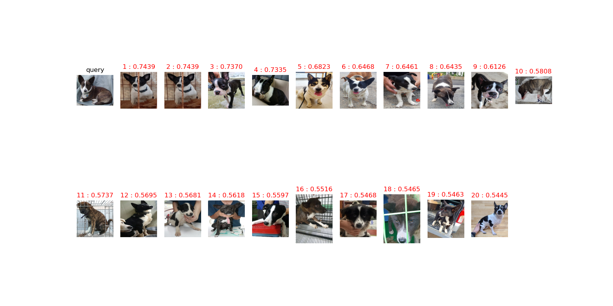

<h1 align="center"> Pet_reID_baseline_pytorch </h1>

### Usage
* [v] Calculating image similarity(cosine distance) 
* [v] Image search at gallery directory or target list
* [v] sorting image similarity
- Query 이미지와 검색 대상 이미지들의 특징을 추출하여 수치화.
- 이미지 특징을 기반으로 image similarity계산. 
- 계산된 수치를 정렬 및 Top N 출력

### Example  

### Model Structure
You may learn more from `model.py`. 
We add one linear layer(bottleneck), one batchnorm layer and relu.

## Prerequisites
- Python 3.6
- GPU Memory >= 6G
- Numpy
- Pytorch 0.3+
- [Optional] apex (for float16) 
- [Optional] [pretrainedmodels](https://github.com/Cadene/pretrained-models.pytorch)

