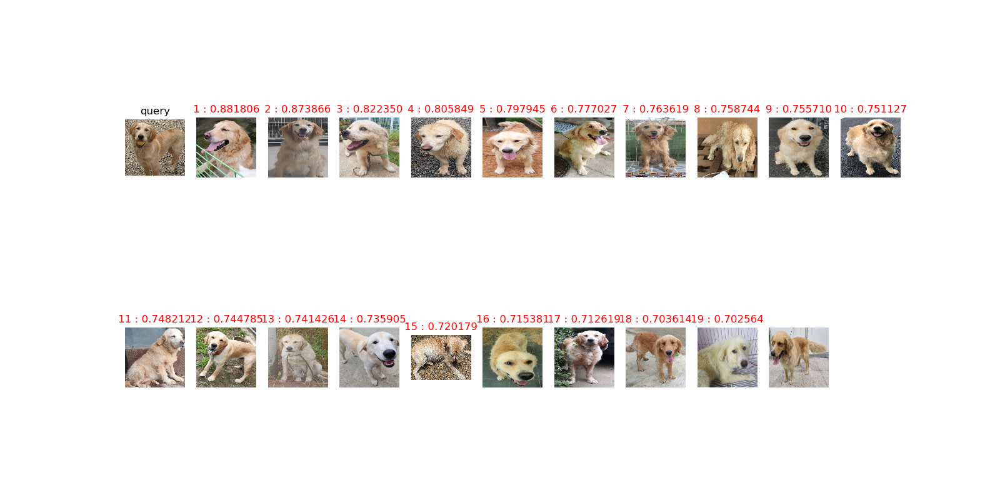

<h1 align="center"> Pet_re_ID </h1>

### Usage
* [v] Calculating image similarity(cosine distance) 
* [v] Image search at gallery directory or target list
* [v] sorting image similarity
- Query 이미지와 검색 대상 이미지들의 특징을 추출하여 수치화.
- 이미지 특징을 기반으로 image similarity계산. 
- 계산된 수치를 정렬 및 Top N 출력

### Example  

### Model Structure
You may learn more from `model.py`. 
We add one linear layer(bottleneck), one batchnorm layer and relu.

## Prerequisites
- Python 3.6
- GPU Memory >= 6G
- Numpy
- Pytorch 0.3+
- [Optional] apex (for float16) 
- [Optional] [pretrainedmodels](https://github.com/Cadene/pretrained-models.pytorch)

## Code 

 - reid_query    
        - # extract_feature, load_network 함수 사용  
        -  # query 이미지를 입력으로 받아 외모적 특징(512개의 vector)을 추출한다. 
                 
 - reid_gallery  # extract_feature, load_network 함수 사용
                 # Crawling 된 유기동물 공고 이미지의 외모적 특징을 뽑아 mat형식으로 저장한다. 
                 # Crawling + YOLO-v4 code에 이어서 실행되어 주기적으로 update.
                 
 - reid_sort     # Query 이미지와 검색 대상 이미지의 특징을 바탕으로 cosine distance를 구한다.
                 # Query 이미지와 가까우면 1, 멀면 0인 값을 가짐.
                 # 내림차순 정렬 
 
