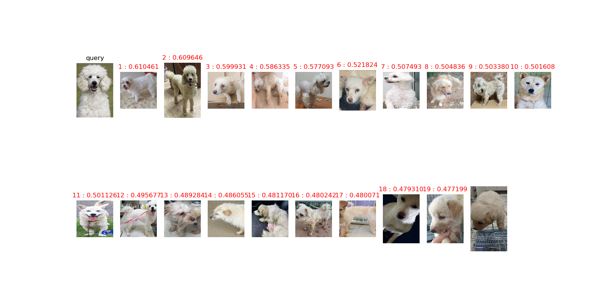

<h1 align="center"> Pet_reID_baseline_pytorch </h1>

### Using
* [v] Calculating image similarity(cosine distance) 
* [v] Image search at gallery directory or target list
* [v] sorting image similarity
- Query 이미지와 검색 대상 이미지들의 특징을 추출하여 수치화.
- 이미지 특징을 기반으로 image similarity계산. 
- 계산된 수치를 정렬 및 Top 10 출력


### Example  
<p align="center"></p>


### Model Structure
You may learn more from `model.py`. 
We add one linear layer(bottleneck), one batchnorm layer and relu.

## Prerequisites
- Python 3.6
- GPU Memory >= 6G
- Numpy
- Pytorch 0.3+
- [Optional] [pretrainedmodels](https://github.com/Cadene/pretrained-models.pytorch)


## Getting started
### Installation
- Install Pytorch from http://pytorch.org/
- Install Torchvision from the source
```
git clone https://github.com/pytorch/vision
cd vision
python setup.py install
```
- [Optinal] You may skip it. Install apex from the source
```
git clone https://github.com/NVIDIA/apex.git
cd apex
python setup.py install --cuda_ext --cpp_ext
```
Because pytorch and torchvision are ongoing projects.

Here we noted that our code is tested based on Pytorch 0.3.0/0.4.0/0.5.0/1.0.0 and Torchvision 0.2.0/0.2.1 .


### Train
Train a model by
```bash
python train.py --gpu_ids 0 --name ft_ResNet50 --train_all --batchsize 32  --data_dir your_data_path
```
`--gpu_ids` which gpu to run.

`--name` the name of model.

`--data_dir` the path of the training data.

`--train_all` using all images to train. 

`--batchsize` batch size.

`--erasing_p` random erasing probability.

Train a model with random erasing by
```bash
python train.py --gpu_ids 0 --name ft_ResNet50 --train_all --batchsize 32  --data_dir your_data_path --erasing_p 0.5
```

### Test
Use trained model to extract feature by
```bash
python test.py --gpu_ids 0 --name ft_ResNet50 --test_dir your_data_path  --batchsize 32 --which_epoch 59
```
`--gpu_ids` which gpu to run.

`--batchsize` batch size.

`--name` the dir name of trained model.

`--which_epoch` select the i-th model.

`--data_dir` the path of the testing data.


### Tips
Notes the format of the camera id and the number of cameras.

For some dataset, e.g., MSMT17, there are more than 10 cameras. You need to modify the `prepare.py` and `test.py` to read the double-digit camera ID.

For some vehicle re-ID datasets. e.g. VeRi, you also need to modify the `prepare.py` and `test.py`.  It has different naming rules.
https://github.com/layumi/Person_reID_baseline_pytorch/issues/107 (Sorry. It is in Chinese)


## Citation
The following paper uses and reports the result of the baseline model. You may cite it in your paper.
```
@article{zheng2019joint,
  title={Joint discriminative and generative learning for person re-identification},
  author={Zheng, Zhedong and Yang, Xiaodong and Yu, Zhiding and Zheng, Liang and Yang, Yi and Kautz, Jan},
  journal={IEEE Conference on Computer Vision and Pattern Recognition (CVPR)},
  year={2019}
}
```

The following papers may be the first two to use the bottleneck baseline. You may cite them in your paper.
```
@article{DBLP:journals/corr/SunZDW17,
  author    = {Yifan Sun and
               Liang Zheng and
               Weijian Deng and
               Shengjin Wang},
  title     = {SVDNet for Pedestrian Retrieval},
  booktitle   = {ICCV},
  year      = {2017},
}

@article{hermans2017defense,
  title={In Defense of the Triplet Loss for Person Re-Identification},
  author={Hermans, Alexander and Beyer, Lucas and Leibe, Bastian},
  journal={arXiv preprint arXiv:1703.07737},
  year={2017}
}
```

Basic Model
```
@article{zheng2018discriminatively,
  title={A discriminatively learned CNN embedding for person reidentification},
  author={Zheng, Zhedong and Zheng, Liang and Yang, Yi},
  journal={ACM Transactions on Multimedia Computing, Communications, and Applications (TOMM)},
  volume={14},
  number={1},
  pages={13},
  year={2018},
  publisher={ACM}
}
```

## Related Repos
1. [Pedestrian Alignment Network](https://github.com/layumi/Pedestrian_Alignment) 
2. [2stream Person re-ID](https://github.com/layumi/2016_person_re-ID) 
3. [Pedestrian GAN](https://github.com/layumi/Person-reID_GAN) 
4. [Language Person Search](https://github.com/layumi/Image-Text-Embedding) 
5. [DG-Net](https://github.com/NVlabs/DG-Net) 
6. [3D Person re-ID](https://github.com/layumi/person-reid-3d) 
